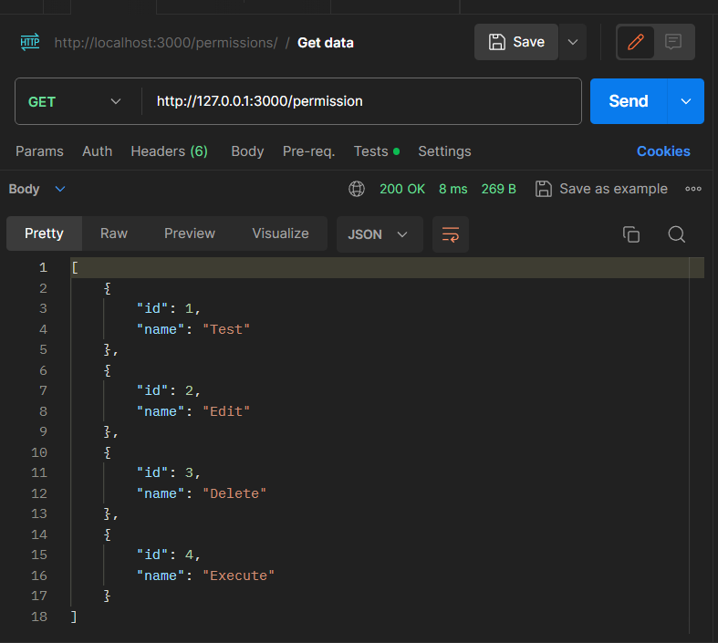
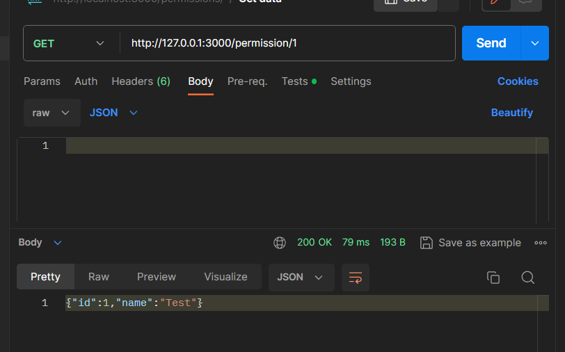
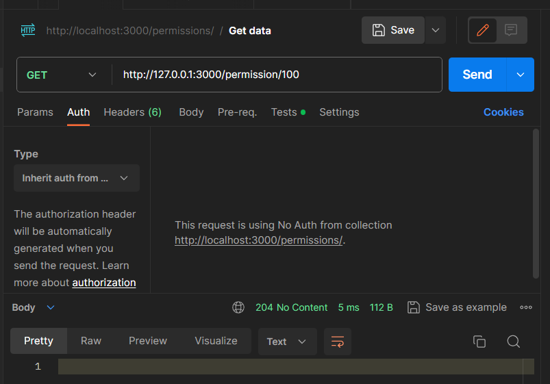
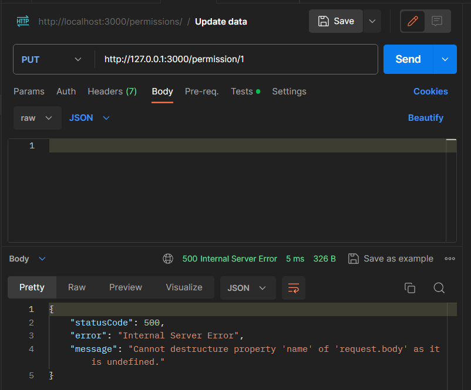
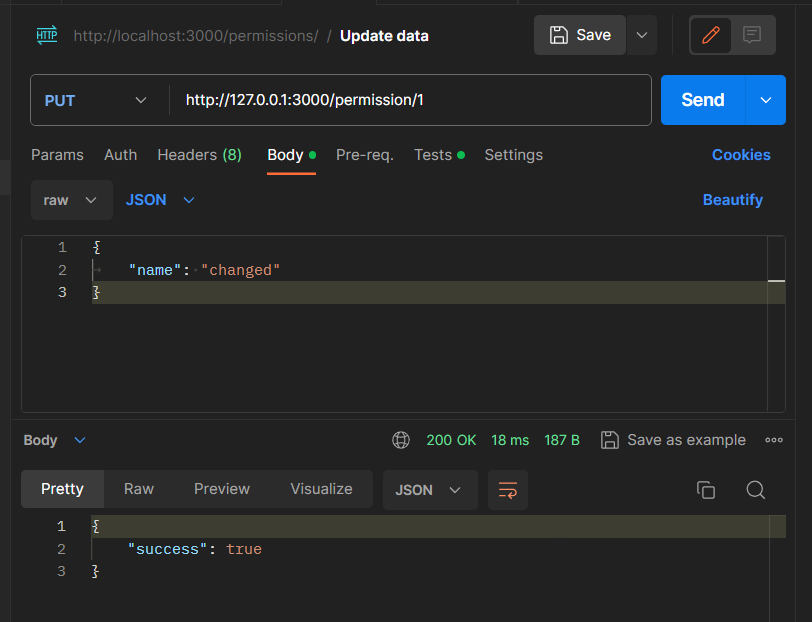
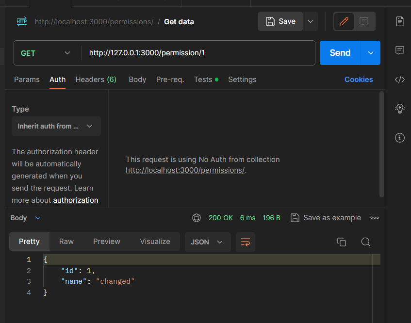
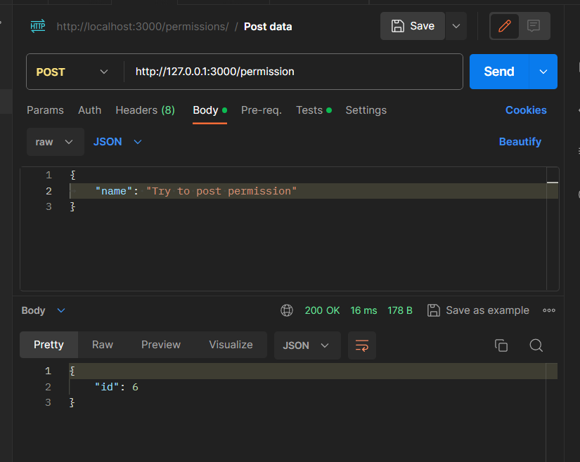
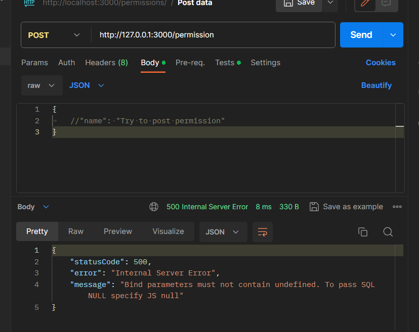
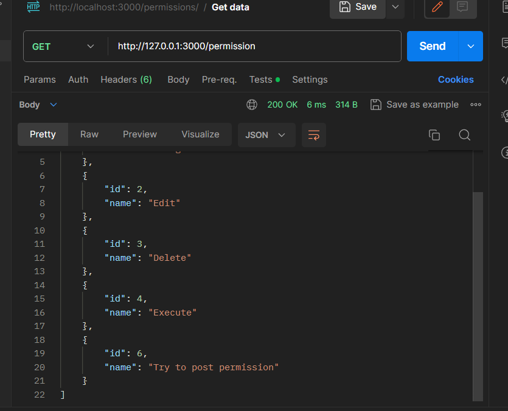
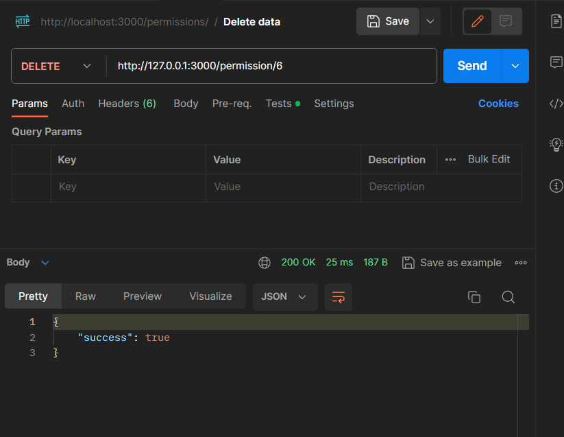

# Тестування працездатності системи

## Інформація про тестування
Тестування відбувається за допомогою програми ***Postman***. Його використання дає змогу виконувати запити з різними методами, параметрами тощо.

## Отримання всіх дозволів

## Отримання одного дозволу

Тут можна побачити спробу отримати інформацію про дозвіл з id = 100, проте такого дозволу не існує у нашії бд, тому сервер повертає нам код ***204*** "No Content".

## Оновлення інформації про роль

Тіло нашого запиту не містить потрібної нам інформації, тому сервер повертає нам код ***500*** та інформує про помилку

Ми вказали інформацію, яку ми хочемо оновити, тож ми отримали відповідь про те, чи відбулася зміна

Перевіряємо чи дійсно інформація була змінена, і отримуємо позитивний результат

## Створення ролі

Відправляємо запит з обов'язковою інформацією, та отримуємо її ID

***name*** - обов'язкове поле, без якого роль не може існувати. Тобто якщо ми спробуємо зробити роль без назви - ми отримаємо код ***400*** та повідомлення про те, що потрібно вказати назву

Задля перевірки, робимо знову запит на отримання всіх дозволів, та помічаємо нові ролі

## Видалення ролі

Намагаємося видалити роль та отримуємо позитивний результат